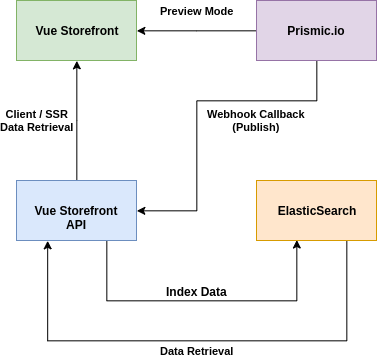

# Vue Storefront Prismic Module

This is the Vue Storefront part (module) of the Prismic integration. It requires the [Vue Storefront API counterpart (extension)](https://github.com/butopea/prismic-vue-storefront-api) to work.  

## Data Flow:

## Features:

- [ ] Dynamic and prefixed URLs (via [mapping fallback](https://github.com/kodbruket/vsf-mapping-fallback/))
- [ ] Server-side rendering (SSR)
- [ ] Preview mode (non-cached, direct data retrieval)
- [ ] In-website edit button
- [ ] Webhook sync callback support (on publish)
- [ ] CLI sync script (cronjob)
- [ ] Queued sync (via Kue)
- [ ] ElasticSearch data cache
- [ ] Slices field support for dynamic page layouts
- [ ] Content retrieval based on ID/UID, custom types, tags, filters, and languages
- [ ] Document search

##Credits

Made with ❤ by [Butopêa](https://butopea.com)

##Support

Please ask your questions regarding this extension on Vue Storefront's Slack https://vuestorefront.slack.com/ You can join via [this invitation link]().

##License

This extension is completely free and released under the MIT License.
